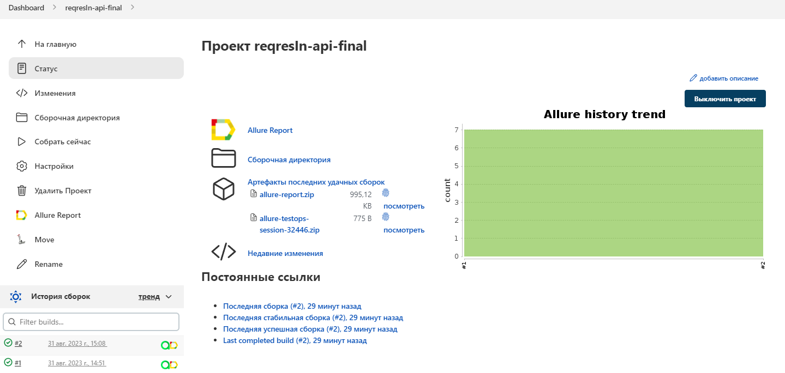
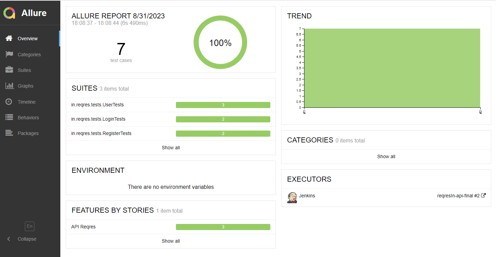
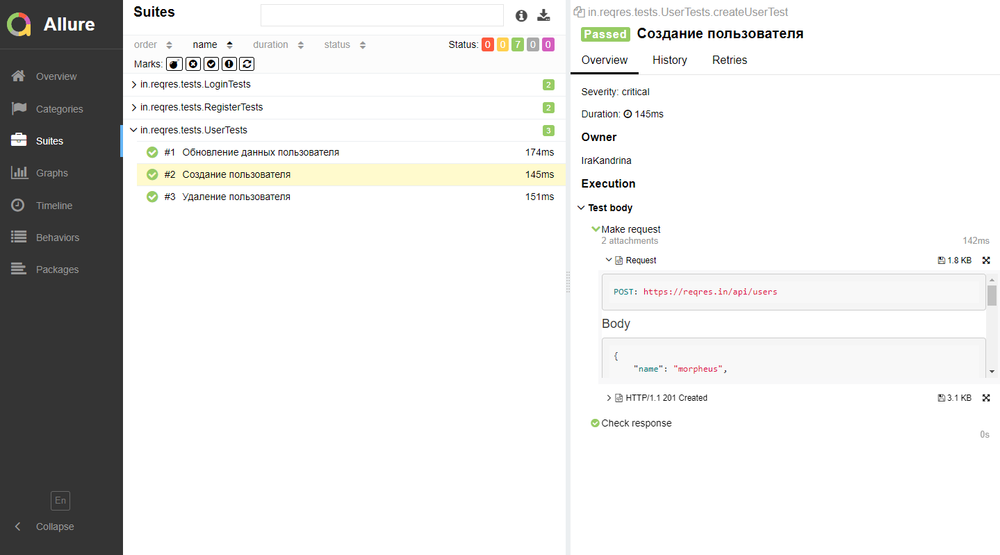
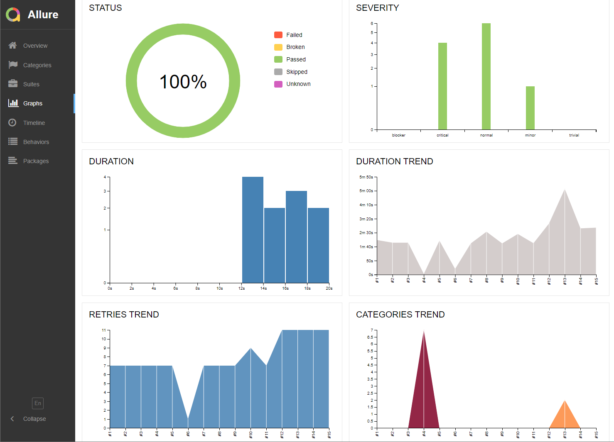
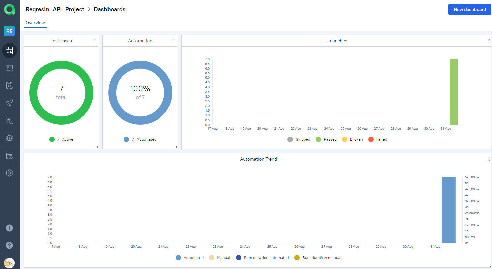
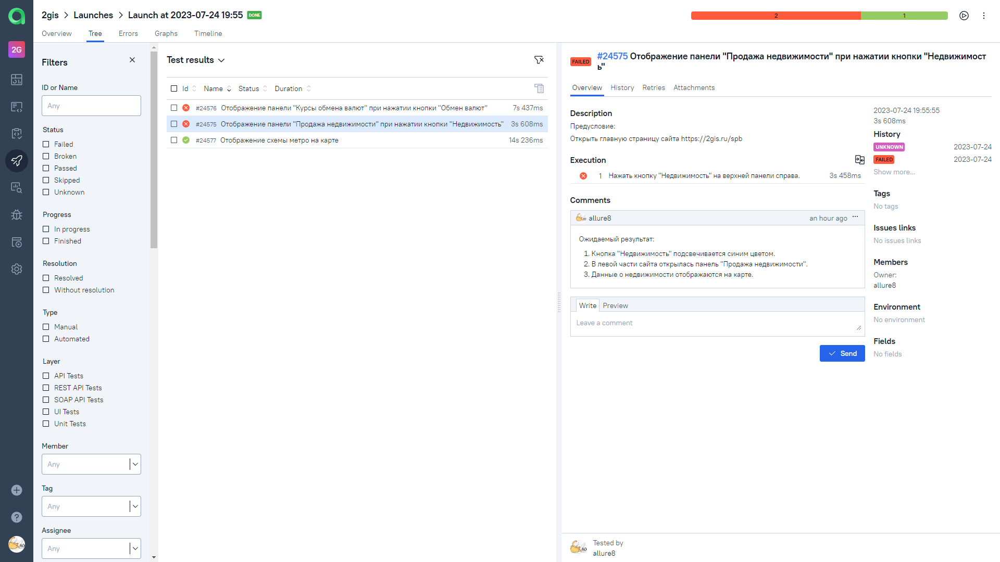
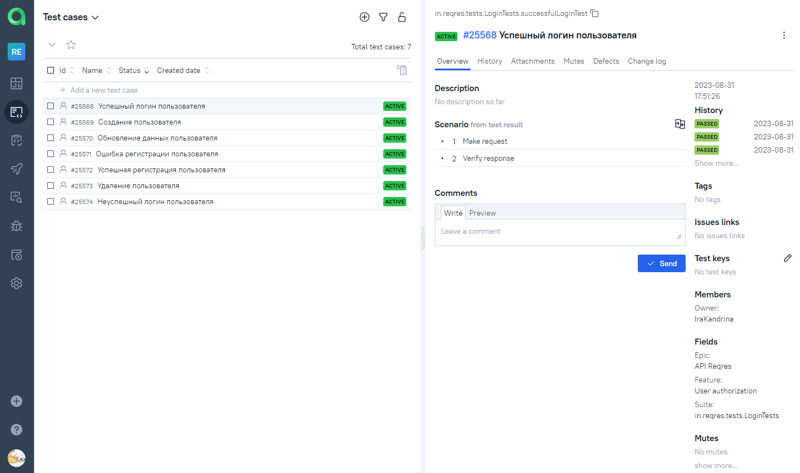
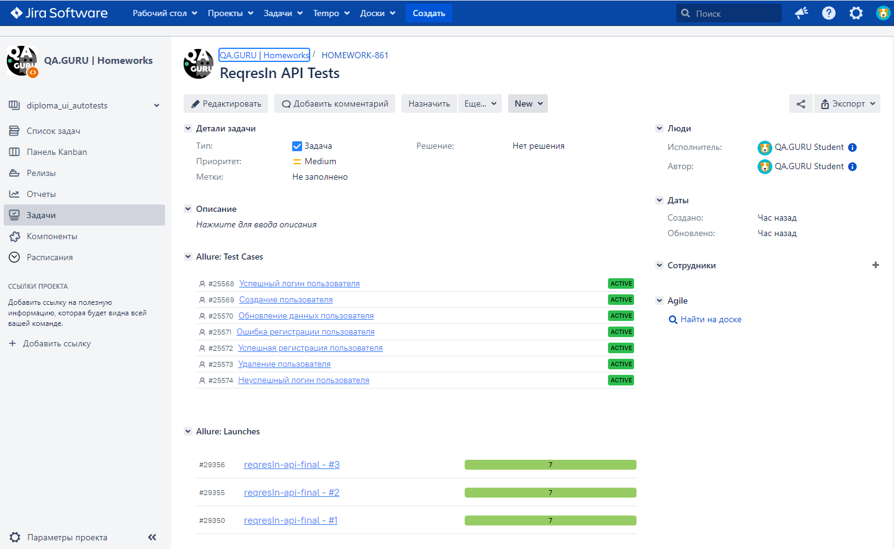
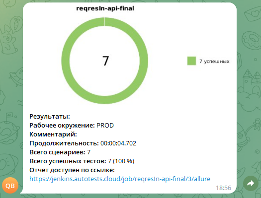

# Проект по автоматизации тестирования API сайта <a href="https://reqres.in/">Reqres.in</a></h1>
____


## **Содержание:**
____

* <a href="#tools">Технологии и инструменты</a>

* <a href="#cases">Реализованные проверки</a>

* <a href="#jenkins">Сборка в Jenkins</a>

* <a href="#console">Запуск из терминала</a>

* <a href="#allure">Allure отчет</a>

* <a href="#allure-testops">Интеграция с Allure TestOps</a>

* <a href="#jira">Интеграция с Jira</a>

* <a href="#telegram">Уведомление в Telegram при помощи бота</a>
____
<a id="tools"></a>
## <a name="Технологии и инструменты">**Технологии и инструменты:**</a>

<p align="center">  
<a href="https://www.jetbrains.com/idea/"></a>  
<a href="https://www.java.com/"></a>  
<a href="https://github.com/"></a>  
<a href="https://junit.org/junit5/"></a>  
<a href="https://gradle.org/"></a>
<a href="https://github.com/allure-framework/allure2"></a> 
<a href="https://qameta.io/"></a> 
<a href="https://rest-assured.io/"></a>
<a href="https://www.jenkins.io/"></a>  
<a href="https://www.atlassian.com/ru/software/jira/"></a>  
</p>

____
<a id="cases"></a>
## Реализованные проверки

- Успешная/неуспешная регистрация пользователя
- Успешная/неуспешная авторизация пользователя
- Создание пользователя
- Обновление данных пользователя
- Удаление пользователя

<a id="console"></a>
## Запуск из терминала
___
***Локальный запуск:***
```bash  
gradle clean test
```

____
<a id="jenkins"></a>
## </a><a name="Сборка"></a>Сборка в [Jenkins](https://jenkins.autotests.cloud/job/reqresIn-api-final/)</a>
> Для запуска необходимо нажать "Собрать сейчас".
____
<p align="center">  
<a href="https://jenkins.autotests.cloud/job/reqresIn-api-final/"></a>  
</p>

___
<a id="allure"></a>
## </a> <a name="Allure"></a>Allure [отчет](https://jenkins.autotests.cloud/job/reqresIn-api-final/2/allure/)</a>
___

### *Основная страница отчёта*

<p align="center">  
  
</p>  

### *Тест-кейсы*

<p align="center">  
  
</p>

### *Графики*

<p align="center">  

</p>

___
<a id="allure-testops"></a>
## </a>Интеграция с <a target="_blank" href="https://allure.autotests.cloud/project/3542/dashboards">Allure TestOps</a>
____
### *Allure TestOps Dashboard*

<p align="center">  
  
</p>  

### *Ручные тест-кейсы*

<p align="center">  
  
</p>

### *Авто тест-кейсы*

<p align="center">  
  
</p>

___
<a id="jira"></a>
## </a> Интеграция с <a target="_blank" href="https://jira.autotests.cloud/browse/HOMEWORK-803">Jira</a>
____
<p align="center">  
  
</p>

____
<a id="telegram"></a>
## </a> Уведомление в Telegram при помощи бота
____
<p align="center">  

</p>

